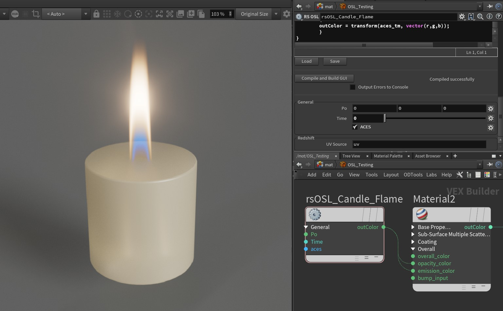
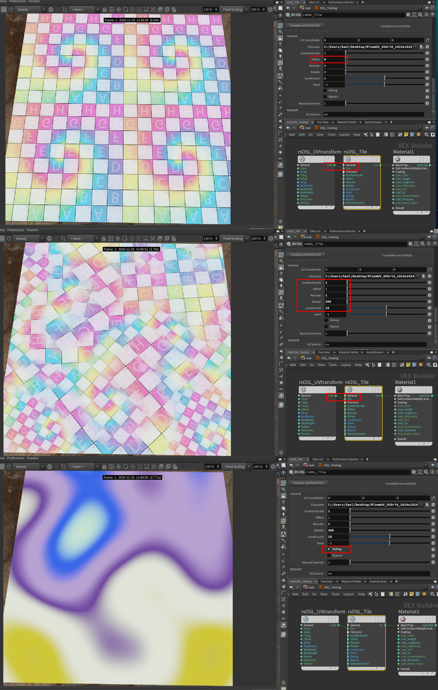
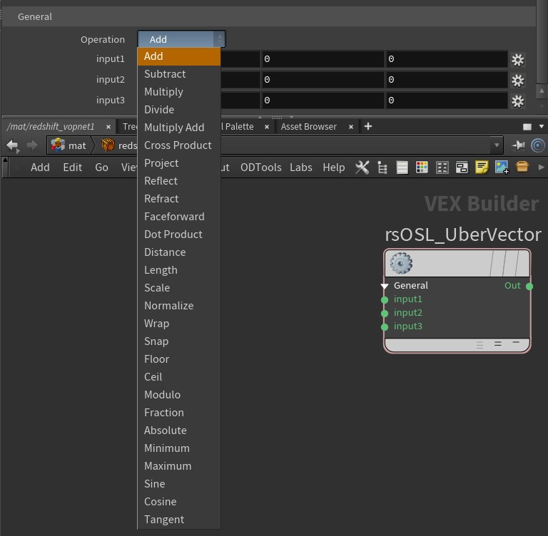

# Redshift OSL Shaders

A collection of [Open Shading Language (OSL)](https://github.com/AcademySoftwareFoundation/OpenShadingLanguage) Shaders for [Redshift](https://www.maxon.net/en/redshift).

### Links

- [redshift3d/RedshiftOSLShaders GitHub Repo](https://github.com/redshift3d/RedshiftOSLShaders)
- [Redshift OSL Support - Open Beta | Redshift Forums](https://redshift.maxon.net/topic/34323/redshift-osl-support-open-beta)

## Shaders

### ACESGamutConvert

[ACESGamutConvert.osl](ACESGamutConvert.osl)

### Blackbody

[Blackbody.osl](Blackbody.osl)

### Candle_Flame

[Candle_Flame.osl](Candle_Flame.osl)

### Clamp

[Clamp.osl](Clamp.osl)

### ColorKeyer

[ColorKeyer.osl](ColorKeyer.osl)

### ColorShuffle

[ColorShuffle.osl](ColorShuffle.osl)

### DegreesToRadians

[DegreesToRadians.osl](DegreesToRadians.osl)

### DiffractionGrating

[DiffractionGrating.osl](DiffractionGrating.osl)

### Dots

[Dots.osl](Dots.osl)

### EnvironmentGradient

[EnvironmentGradient.osl](EnvironmentGradient.osl)

### FakeCaustics

[FakeCaustics.osl](FakeCaustics.osl)

### Flakes

[Flakes.osl](Flakes.osl)

### HDRIEnviron

[HDRIEnviron.osl](HDRIEnviron.osl)

### HSVsplitter

[HSVsplitter.osl](HSVsplitter.osl)

### HagelslagNoise

[HagelslagNoise.osl](HagelslagNoise.osl)

### Halftone

[Halftone.osl](Halftone.osl)

### Hexagon

[Hexagon.osl](Hexagon.osl)

### Iridescence

[Iridescence.osl](Iridescence.osl)

### JawbreakerNoise

[JawbreakerNoise.osl](JawbreakerNoise.osl)

### JiWindowBox_Redshift

[JiWindowBox_Redshift.osl](JiWindowBox_Redshift.osl)

JiWindowBox_template_Examples_Redshift.zip

### Jitter

[Jitter.osl](Jitter.osl)

### LiftGammaGain

[LiftGammaGain.osl](LiftGammaGain.osl)

Luma_Shader.osl

### MarbleShader

[MarbleShader.osl](MarbleShader.osl)

### Matcap

[Matcap.osl](Matcap.osl)

MatrixMath.osl

### MelaninColor

[MelaninColor.osl](MelaninColor.osl)

### NishitaSky

[NishitaSky.osl](NishitaSky.osl)

### NoiseColor

[NoiseColor.osl](NoiseColor.osl)

### PaintColors

[PaintColors.osl](PaintColors.osl)

### ParallaxOcclusionMapping

[ParallaxOcclusionMapping.osl](ParallaxOcclusionMapping.osl)

### Posterize

[Posterize.osl](Posterize.osl)

### Radians to Degress

[RadiansToDegrees.osl](RadiansToDegrees.osl)

### RandomBitmaps

[RandomBitmaps.osl](RandomBitmaps.osl)

### Scratches

[Scratches.osl](Scratches.osl)

### Shapes

[Shapes.osl](Shapes.osl)

### SimpleTiles

[SimpleTiles.osl](SimpleTiles.osl)

### SlopeMask

[SlopeMask.osl](SlopeMask.osl)

### Space Transform

[SpaceTransform.osl](SpaceTransform.osl)

### Starfield

[Starfield.osl](Starfield.osl)

### SubstanceFlow

[SubstanceFlow.osl](SubstanceFlow.osl)

### TextureNoTile

[TextureNoTile.osl](TextureNoTile.osl)

### TextureNoTile_Example

### Thin Film Interference

[ThinFilmInterference.osl](ThinFilmInterference.osl)

### TooledSteel

[TooledSteel.osl](TooledSteel.osl)

### TurbulentColor

[TurbulentColor.osl](TurbulentColor.osl)

### UVWTransform

[UVWTransform.osl](UVWTransform.osl)

### UberColorCorrect.png

[UberColorCorrect.osl](UberColorCorrect.osl)

### UberConstant.jpg

[UberConstant.osl](UberConstant.osl)

### UberScalar

[UberScalarMath.osl](UberScalarMath.osl)

### UverVector

[UberVectorMath.osl](UberVectorMath.osl)

### Wavelength

[Wavelength.osl](Wavelength.osl)

### Weave

[Weave.osl](Weave.osl)

### WoodGrain

[WoodGrain.osl](WoodGrain.osl)
